# Battleships
Welcome! My name is Gavin O'Connor and this is my python essentials project which allows the user to play a game of Battleships. The game is played by entering commands into a terminal running on Heroku. The user plays against the computer as both players try to guess the location of the others battleships. The first player to guess all five of the others battleships wins. There is an adjustable difficulty level in the form of turns, where the user can pick the amount of turns they want, the fewer turns the harder the game.

You can access the live game [here](https://ci-project-3-gavin.herokuapp.com/).

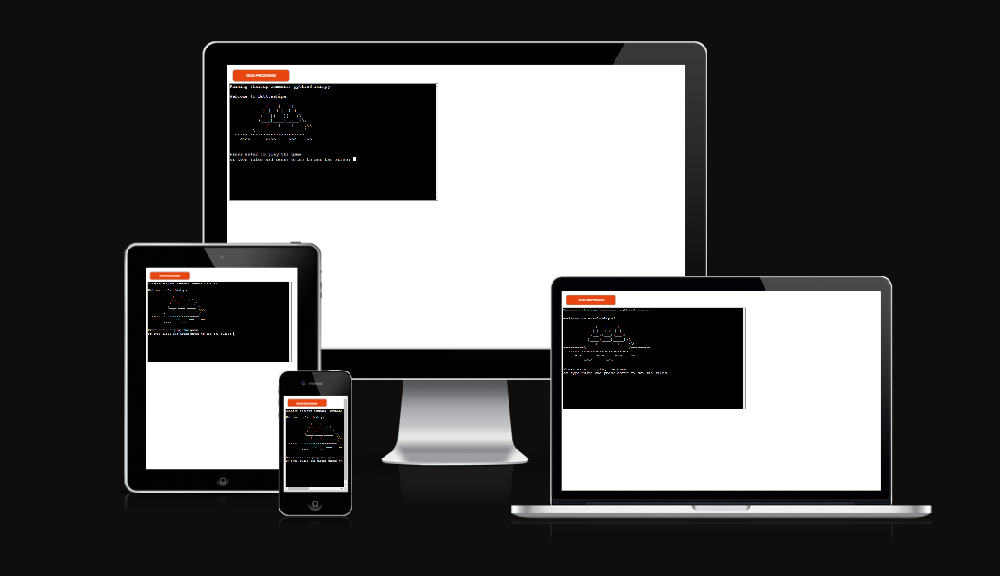

# Table of Contents
[User Experience (UX) Design](#user-experience-ux-design)
 - [User Goals](#user-goals)
 - [User Expectations](#user-expectations)
 - [Game Logic](#game-logic)

[How to Play](#how-to-play)

[Features](#features)
 - [Welcome message](#welcome-message)
 - [Rules screen](#rules-screen)
 - [Choose turns](#choose-turns)
 - [Place ships](#place-ships)
 - [Player and computer guesses](#player-and-computer-guesses)
 - [Play again](#play-again)

[Validation](#validation)
 - [Rules validation](#rules-validation)
 - [Turns validation](#turns-validation)
 - [Place ships validation](#place-ships-validation)
 - [Guess validation](#guess-validation)
 - [Play again validation](#play-again-validation)

[Testing](#testing)
 - [PEP8](#pep8)
 - [Manual testing](#manual-testing)

[Solved Bugs](#solved-bugs)

[Technologies used](#technologies-used)

[Deployment](#deployment)

[Project Screenshots](#project-screenshots)

[Acknowledgements](#acknowledgements)

# User Experience (UX) Design
[Go to top](#table-of-contents)

## User Goals
[Go to top](#table-of-contents)

The user goals for this project are the following:
 - To provide a fun and functional game to the user with replayability in the form of variance each time the game is played based on user input
 - To provide a clear and concise overview of the rules of the game that allows the player to play through the game with no confusion
 - To make the game instructions and requests clear to the player so they know exactly how to proceed through the game
 - To provide an engaging game experience that encourages the player to try their best to beat the computer and win

## User Expectations
[Go to top](#table-of-contents)

The user expectations I expect when engaging with this game are the following:
 - The user should expect to understand fully how to play the game and what they need to do at any point in the game process
 - The user should expect to be able to win the game
 - The user should expect to have fun with the game

## Game Logic
[Go to top](#table-of-contents)

I created a logic map before starting development on the game itself, which allowed me to visualize what elements and features needed to be implemented as well as to set a scope for my game that needed to be met. The logic map was created using [Lucid Chart](https://www.lucidchart.com). The logic map can be seen below:

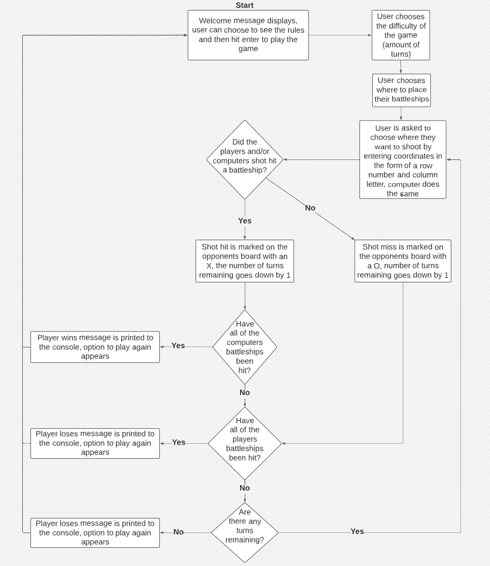

# How to play
[Go to top](#table-of-contents)

The game opens with a welcome message that asks the player to enter rules to see the game rules, or press the enter key to start playing the game. If the player types rules and the enter, the game rules will appear in order from the start of the game to the end. The rules screen then asks the player to press the enter key to start the game. Once they do, the game asks them to enter the number of turns they want to start with from 1 to 60. The game board has 64 spots so 60 was chosen as the highest turn amount if the player wants a very forgiving game experience where chance of losing by running out of turns is very low. 

Once the player enters the amount of turns they want, they are asked to enter the row of where they want to place a battleship on their board, number 1-8. Then they are asked to enter the column of where they want to place their ship, letters A-H. They are asked this five times until all five of their ships are placed on their game board. Then both the player and computer game boards are printed to the console and the player is asked to guess their opponents battleship locations. They are asked to enter the row of where they want to guess that the opponents battleship is located, and then the column. After entering the coordinates of their guess, both game boards are printed again with hit or miss marks on them to indicate if each players guess hit or missed a battleship. They are told if they hit a battleship, missed, or if they already entered those coordinates they will be asked to enter different coordinates. They are told the coordinates of where the computer guessed and if the computer hit or missed. Lastly, they are told how many turns they have remaining.

If the player hits all five of the computers battleships they will be told 'Congratulations, you sank all of the computer's battleships' and they are then asked if they want to play again. if they enter yes, the game starts over again from the welcome screen and the game boards are wiped of all markers. If they enter no a message 'Thank you for playing!' appears and the program quits running. If the computer hits all five of the players battleships the message 'The computer sank all of your battleships, you lose!' appears and the player is asked if they want to play again. If the player runs out of lives before either the player or computers battleships are all sunk, then the message 'Sorry, you have no turns left, Game Over' appears and the player is asked if they want to play again.

# Features
[Go to top](#table-of-contents)

## Welcome message
[Go to top](#table-of-contents)

Upon starting the program, a welcome message appears welcoming the user to the game, displaying ascii art of a ship, and asking the player to type 'rules' to see the rules or hit enter to start the game.

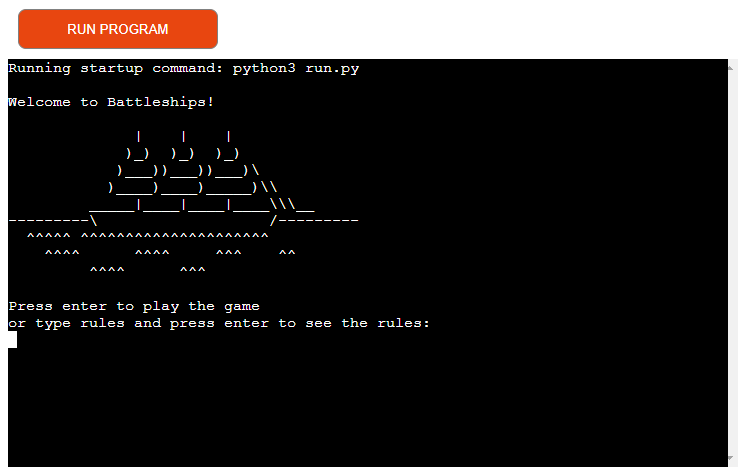

## Rules screen
[Go to top](#table-of-contents)

If the user typed rules when prompted on the welcome message screen and hit enter, the rules for the game will display in the terminal. The rules appear in order, going step by step through what will happen when they play the game and what they must do at each step.

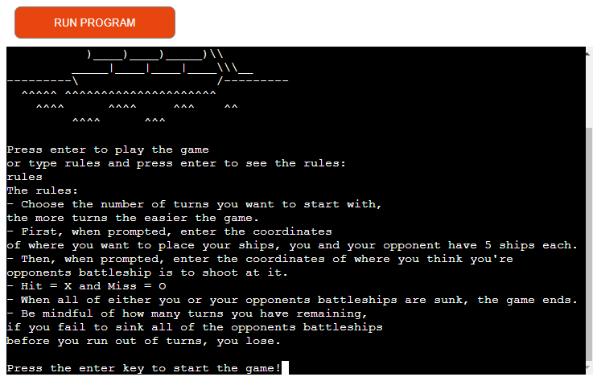

## Choose turns
[Go to top](#table-of-contents)

After hitting enter to play the game, the user is prompted to enter the number of turns they want to start the game with. The more turns they start with the easier the game is as they will have more turns to guess all five of the computers battleships. The amount of turns they can choose from are capped at 60. The game boards have 64 spaces so 60 turns allows the user to make the game much easier for themselves without eliminating the threat of running out of lives entirely.

## Place ships
[Go to top](#table-of-contents)

After the user chooses how many turns they want to start the game with, they are then asked to enter the row number and column letter they want to place their ship in. They are asked this five times until all five of their ships are placed.

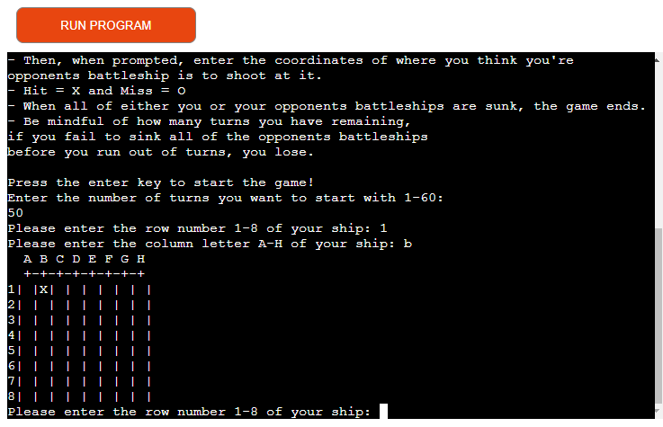

## Player and Computer guesses
[Go to top](#table-of-contents)

After the user has placed all five of their ships, the player and computer boards are printed to the terminal that will mark the spots where the players guessed on each turn, and whether those guesses were hits or misses. The user will then be prompted to guess the location of the computers battleships by entering a row number and column letter.

After the user makes their guess, the computer does as well and then the boards will print again on the next turn showing a hit or miss mark from all previous guesses, hits are marked with an X and misses are marked with an O. The user is then prompted to make their next guess.

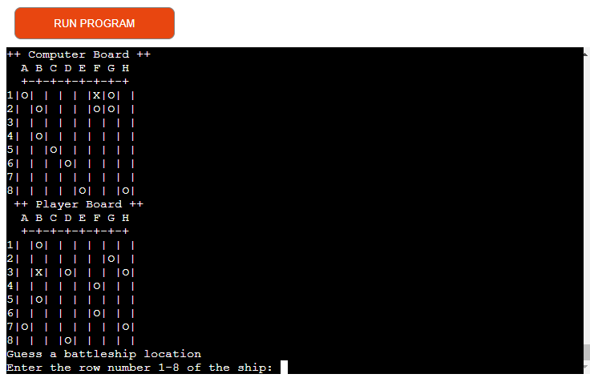

When the player and computer make their guesses, text will display showing if the player hit or missed, the coordinates of where the computer guessed and whether they hit or missed, and how many turns the user now has remaining.

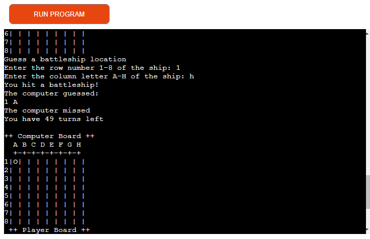

## Play again
[Go to top](#table-of-contents)

If the user sinks all of the computers battleships, has all of their battleships sunk by the computer, or runs out of turns a prompt will appears asking the user if they want to play again. If they type yes then the game will return to the welcome message screen. If they type no then the terminal will display a thank you message and the program will exit.

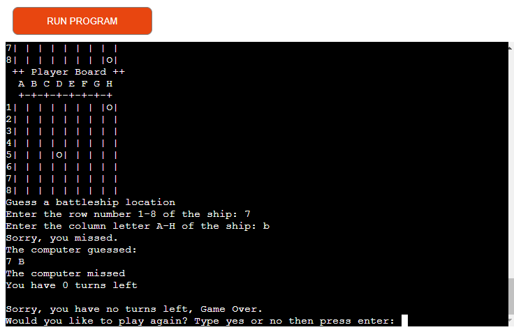

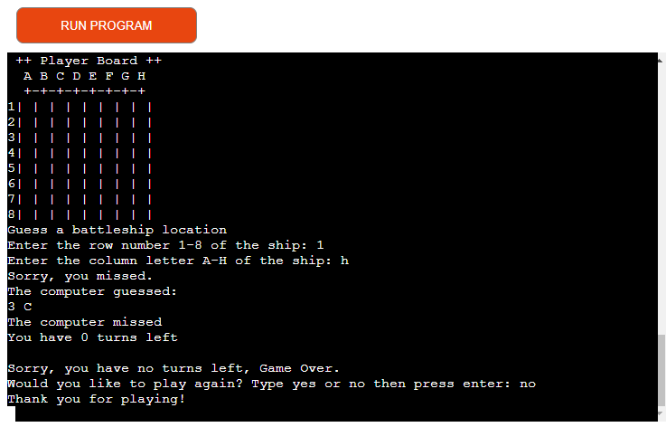

# Validation
[Go to top](#table-of-contents)

## Rules validation
[Go to top](#table-of-contents)

When prompted to press enter to play the game or type rules then press enter to see the rules, if the user types any of the letters within the word 'rules', then the rules screen will be displayed. This is to combat typos. If the user spells rules incorrectly the rules screen will still appear, as opposed to the user being pushed into the game even though they don't know the rules. As it is not possible to go back a step in the terminal, this was the best solution. If the user types anything that does not appear in the word 'rules' and presses enter, the game will start. An input error message was not necessary here as besides anything in the word 'rules', whatever the user enters here is irrelevant from that point on in the game. So if the user accidentally hits a key on their keyboard and then presses enter, the game will still play.

## Turns validation
[Go to top](#table-of-contents)

When prompted to enter the number of turns they want to start the game with, if the user enters any value that is not a number between 1-60 then an error message will display and the user will be asked to enter the number of turns again. If the user presses the enter key without entering any value, the same error message will display as well.

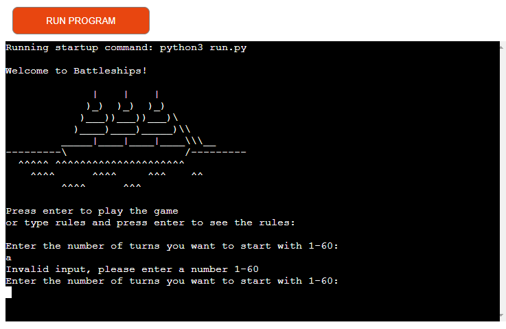

## Place ships validation
[Go to top](#table-of-contents)

When prompted to enter the row and column of where they want to place their battleships, the user must enter a number 1-8 for the row and a letter a-h for the column. If the user enters anything else or presses the enter key without typing a value then an error message will display and they will be asked to enter the row or column again. The user is allowed to enter a lower case letter for the column as an upper method in the code will change it to an uppercase letter in the back end.

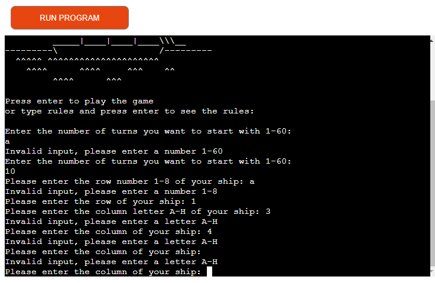

## Guess validation
[Go to top](#table-of-contents)

When prompted to guess the row and column of the computers battleships, the user must enter a number 1-8 for the row and a letter a-h for the column. If the user enters anything else or presses the enter key without typing a value then an error message will display and they will be asked to enter the row or column again.

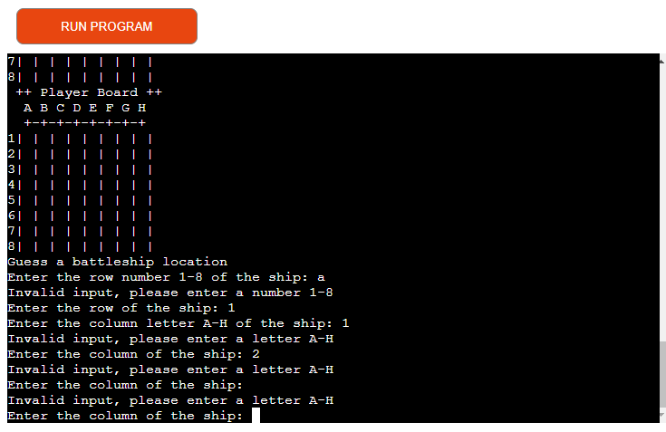

## Play again validation
[Go to top](#table-of-contents)

When the user is prompted if they want to play the game again, they must enter yes or no. If they enter anything else or press the enter key without typing anything, an error message will appear and the prompt will ask them again to enter yes or no.

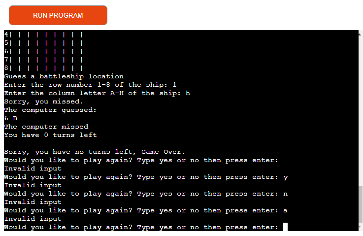

# Testing
[Go to top](#table-of-contents)

## PEP8
[Go to top](#table-of-contents)

Using Gitpods built in python validator, several problems were detected on project completion:

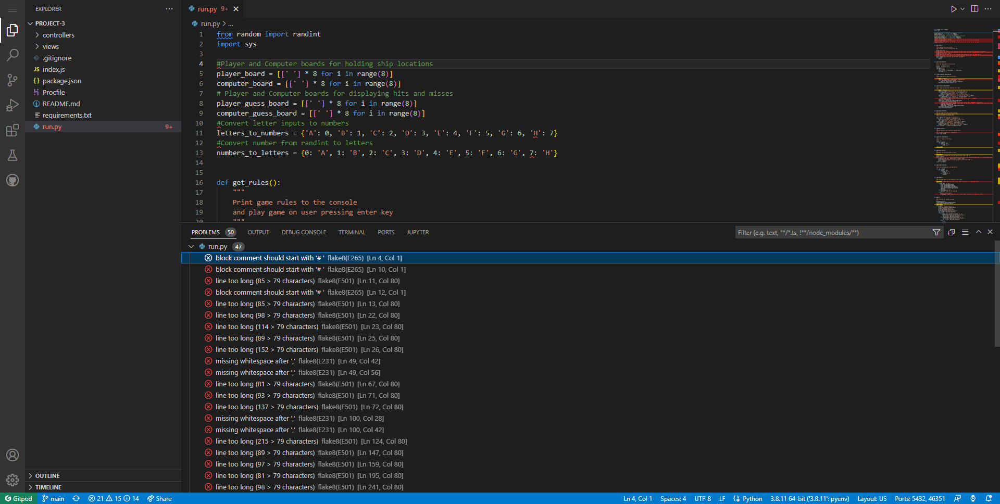

The first type of problem was that I was missing a space after the # for my code comments. I placed a space after the # to resolve this.
The second type of problem was that I was missing a space after the ',' in my randint methods. I placed a space after the ',' to resolve this.
The third and most prominent type of problem was that several of my code lines were too long. I used line breaks on the lines that were too long to resolve this.

After I resolved the above problems, the python validator showed no red 'important' problems. There remained some warnings/recommendations, however these had no effect on my code.

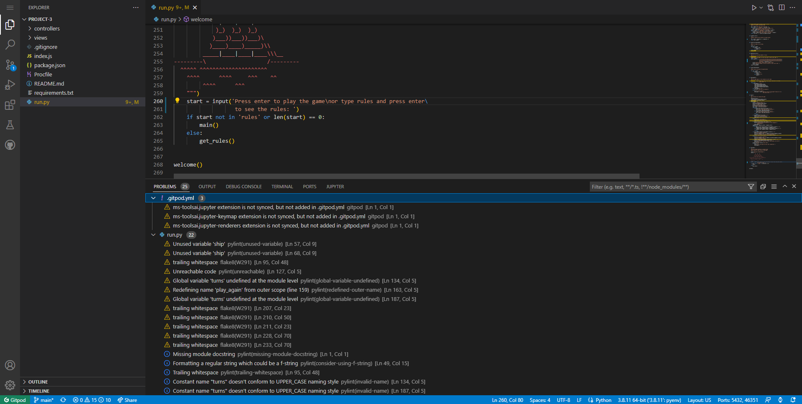

## Manual Testing
[Go to top](#table-of-contents)

I manually tested if the game was working correctly using various different methods. The first method was to enter 1 turn when prompted by the game. This would allow me to test the end of game screen and messages/inputs quickly without having to play the game for too long each time. The second method was to change the required score for the player and computer to win the game from 5 to 1. Again, this made testing the win and lose screens alot quicker and easier as I only had to play until 1 battleship was hit by either player as opposed to 5. To make this process even quicker, I temporarily added code to print the computers board to the terminal, so that I could see exactly where the computers battleships were located and guess the ships easily and quickly. 

I also ran through the game using the final code with various amounts of turns inputted to ensure the normal game experience functioned correctly. I did this on both Gitpod and Heroku numerous times through the project creation process and again upon project completion. Incorrect inputs were entered every time an input was requested to test input validation, changes to the game code were made whenever the program crashed from an invalid input.

# Solved Bugs
[Go to top](#table-of-contents)

In order to properly play the game after entering yes to the play again prompt, all hit and miss marks must be cleared from the game boards. I attempted to accomplish this by using the same method I used to count the number of hit 'X' markers on both players guess boards. The difference is that instead of counting the X markers, I would have the function replace them with an empty space. The same for the miss 'O' markers. Thus the boards would be cleared of all markers and the game could be played again from scratch. Initially my solution did not work and the X markers remained on the boards even after the game was played again. After submitting this project to Code Institute for evaluation, I received feedback that this would need to be fixed to make the game work completely. With the help of my mentor, I managed to fix this bug by setting some variables to global, allowing the game boards to be fully cleared once the player said 'yes' to the replay game option. Having this bug fixed has now allowed the game to be played, completed, and replayed as much as the player wants with no interruptions and has given me great insight into the process of bug fixing developers must do for all of their projects.

# Technologies used
[Go to top](#table-of-contents)

 - [Github](https://github.com/) was used to create the repository that hosts the site and to store the project's code after it was pushed from Git.
 - [Gitpod](https://gitpod.io/workspaces) was used as the Code Editor used for the site.
 - [Heroku](https://www.heroku.com) was used to host the game terminal and game code as an app
 - [Am I Responsive](https://ui.dev/amiresponsive) was used to display what the game looks like on various screen sizes

# Deployment
[Go to top](#table-of-contents)

This project was deployed to Heroku from Github, Heroku was used to create the terminal in which the game is played.

These are the deployment steps:

1. Push all code to Github
2. Go to [Heroku](https://www.heroku.com)
3. Click button labeled 'Sign up for free'
4. Enter details, click 'Create free account'
5. Click link in verification email sent to entered email address
6. Create new password, click 'Set password and Login'
7. Accept terms of service
8. Click 'Create new app'
9. Enter app name and select Europe as the region, click create app
10. Click settings tab, click 'Reveal Config Vars'
11. Enter key as PORT and value as 8000
12. Click 'Add buildpack', click 'Python', click 'Save Changes'
13. Click 'Add buildpack, click 'NodeJS', click 'Save Changes'
14. Ensure 'Python' is above 'NodeJS' in the buildpack list
15. Click 'Deploy' tab, click 'Connect to Github'
16. Click 'Connect to Github', sign in to Github in window that appears
17. Search repository name in search bar 'project-3'
18. Click repository 'project-3' that appears, click 'Connect'
19. Scroll down, under 'Choose a branch to deploy' ensure 'main' is selected
20. Click 'Deploy Branch', then 'View' when deployment is complete

# Project screenshots
[Go to top](#table-of-contents)

Welcome message

Rules

Enter the amount of game turns to start the game with

Enter the coordinates of where the user would like to place their battleships

Guess the location of the computers battleships

The player and computer boards are printed each turn showing hits and misses from all previous guesses. Hits are marked with an X and misses are marked with an O.

Text displays after the user makes their guess showing if they hit or missed, what coordinates the computer guessed and if they hit or missed, and how many turns are remaining.

If the user hits all of the computers battleships, a win message appears and a prompt asking the user if they want to play again.

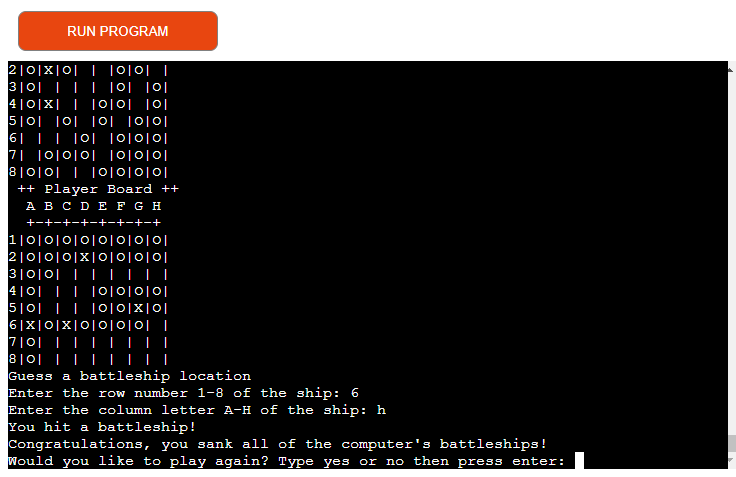

If the computer sinks all of the users battleships, then a lose message appears and a prompt asking the user if they want to play again.

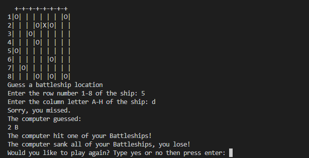

If the user runs out of turns, then a lose message appears and a prompt asking the user if they want to play again.

If the user enters yes to the play again prompt, then the welcome message screen is displayed again, if the user enters no to the play again prompt a thank you for playing message displays.

# Acknowledgements
[Go to top](#table-of-contents)

 - Initial battleship game tutorial found [here](https://www.youtube.com/watch?v=tF1WRCrd_HQ&t=909s&ab_channel=KnowledgeMavens)
 - Solution for when input is empty found [here](https://stackoverflow.com/questions/26247729/how-do-i-get-python-to-recognize-that-there-has-been-no-input)
 - Ascii artwork for welcome message found [here](https://asciiart.website/index.php?art=transportation/nautical)
 - How to print ascii art to the terminal found [here](https://stackoverflow.com/questions/23623288/print-full-ascii-art)
 - Function randint imported from random and sys imported
 - Many thanks to my mentor Marcel for his help and guidance